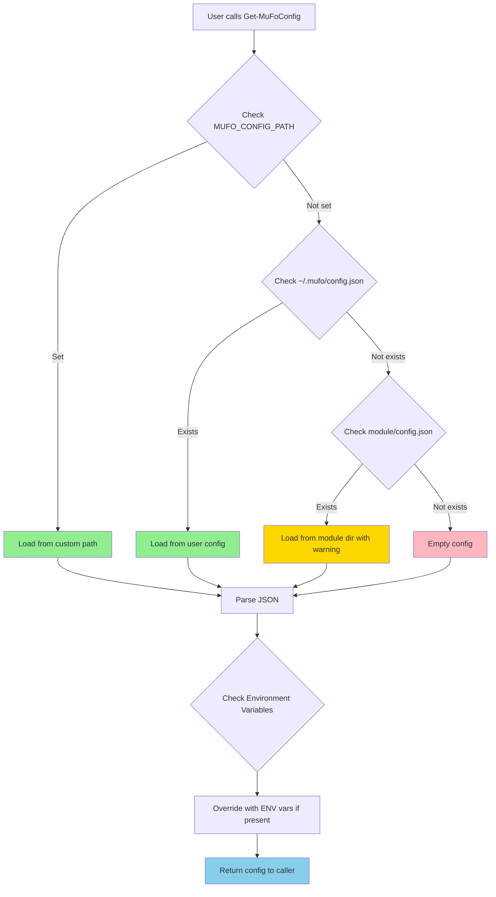
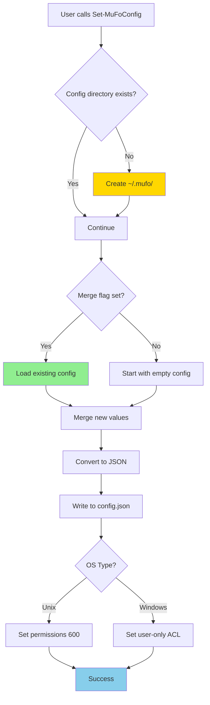
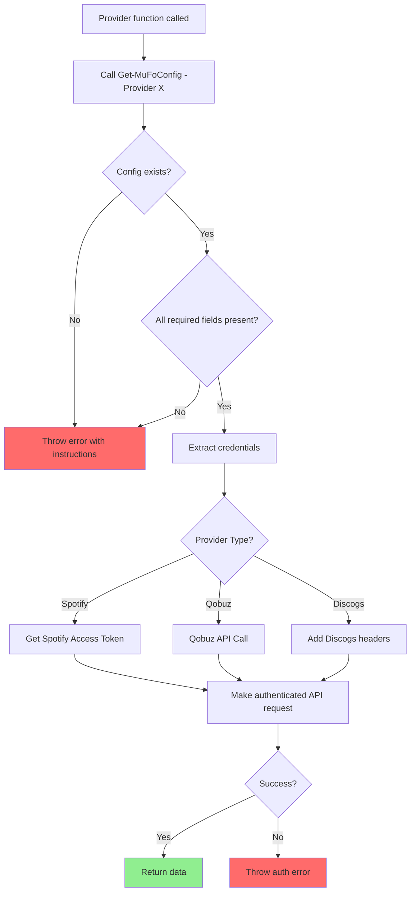
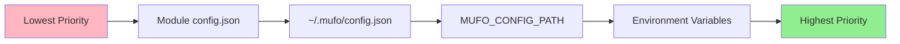
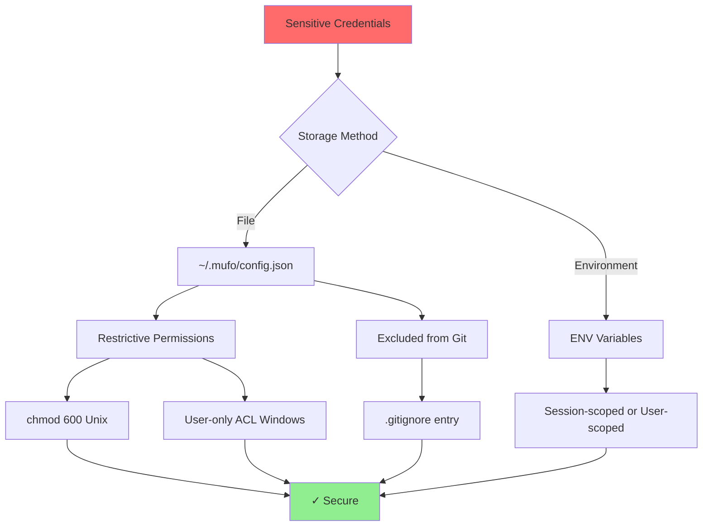

# MuFo Configuration Architecture

## Configuration Loading Flow



## Configuration Storage Flow



## Provider Authentication Flow



## Configuration Priority



## File System Layout

```
User Home Directory
├── .mufo/                          # User config directory
│   └── config.json                 # Secure credentials (600 permissions)
│
MuFo Module Directory
├── Public/
│   ├── Get-MuFoConfig.ps1         # Retrieve credentials
│   ├── Set-MuFoConfig.ps1         # Save credentials
│   └── Test-MuFoConfig.ps1        # Validate credentials
├── Private/
│   └── [Provider helpers use Get-MuFoConfig]
├── config.example.json             # Template (safe to commit)
├── .gitignore                      # Excludes config.json
└── documentation/
    ├── CONFIGURATION-GUIDE.md      # Full setup guide
    └── CONFIG-QUICKREF.md          # Quick reference
```

## Security Model



## Usage Pattern for Developers

```powershell
# Pattern 1: Simple retrieval
function MyProviderFunction {
    $config = Get-MuFoConfig -Provider Spotify
    if (-not $config) { throw "Configure with Set-MuFoConfig" }
    
    # Use $config.ClientId, $config.ClientSecret
}

# Pattern 2: With validation
function MyProviderFunction {
    $config = Get-MuFoConfig -Provider Discogs
    
    if (-not $config -or -not $config.Token) {
        throw @"
Discogs not configured.
Run: Set-MuFoConfig -DiscogsToken 'your_token'
See: https://www.discogs.com/settings/developers
"@
    }
    
    # Use $config.Token
}

# Pattern 3: Testing
function Connect-MyProvider {
    # Test config before attempting connection
    $testResult = Test-MuFoConfig -Provider Spotify -SkipValidation
    
    if (-not $testResult.ConfigComplete) {
        throw "Incomplete Spotify configuration"
    }
    
    $config = Get-MuFoConfig -Provider Spotify
    # Proceed with connection...
}
```

## Extension Points

To add a new provider (e.g., "MusicBrainz"):

1. **Add to config structure**:
   ```json
   {
     "MusicBrainz": {
       "ApiKey": "your_key"
     }
   }
   ```

2. **Update `Get-MuFoConfig`** (automatic - uses JSON structure)

3. **Update `Set-MuFoConfig`**:
   ```powershell
   [Parameter(Mandatory = $false)]
   [string]$MusicBrainzApiKey
   ```

4. **Update `Test-MuFoConfig`**:
   ```powershell
   'MusicBrainz' {
       $result.ConfigComplete = ($providerConfig.ApiKey -ne $null)
       # Add validation logic...
   }
   ```

5. **Update ValidateSet** in provider wrappers:
   ```powershell
   [ValidateSet('Spotify', 'Qobuz', 'Discogs', 'MusicBrainz')]
   ```
